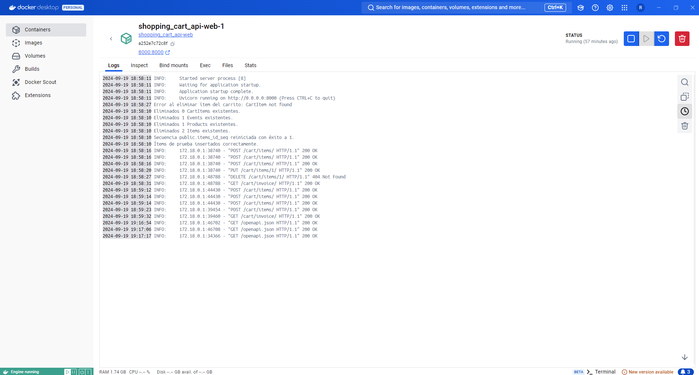

# Shopping Cart API

**Shopping Cart API** es una API RESTful desarrollada con FastAPI para gestionar un carrito de la compra. Permite agregar, actualizar y eliminar ítems en el carrito, así como obtener información detallada y generar facturas.

## Índice de Contenidos

1. [Descripción](#descripción)
2. [Características](#características)
3. [Tecnologías Utilizadas](#tecnologías-utilizadas)
4. [Instalación](#instalación)
    - [Prerrequisitos](#prerrequisitos)
    - [Clonar el Repositorio](#clonar-el-repositorio)
    - [Configuración del Entorno Virtual](#configuración-del-entorno-virtual)
    - [Instalar Dependencias](#instalar-dependencias)
    - [Configuración de la Base de Datos](#configuración-de-la-base-de-datos)
    - [Ejecutar Migraciones](#ejecutar-migraciones)
    - [Poblar la Base de Datos](#poblar-la-base-de-datos)
    - [Ejecutar la Aplicación](#ejecutar-la-aplicación)
    - [Usando Docker](#usando-docker)
5. [Modelo de Datos](#modelo-de-datos)
6. [Documentación de la API](#documentación-de-la-api)
    - [Estructura de URLs](#estructura-de-urls)
    - [Descripción de Endpoints](#descripción-de-endpoints)
7. [Gestión de Errores](#gestión-de-errores)
8. [Pruebas Realizadas](#pruebas-realizadas)
9. [Mejoras y Funcionalidades Futuras](#mejoras-y-funcionalidades-futuras)
10. [Contribuciones](#contribuciones)
11. [Licencia](#licencia)
12. [Contacto](#contacto)

---

## Descripción

**Shopping Cart API** es una solución completa para gestionar carritos de compra en aplicaciones de comercio electrónico. Permite a los usuarios agregar productos y eventos al carrito, actualizar cantidades, eliminar ítems y obtener resúmenes detallados del carrito, incluyendo subtotales y facturas.

---

## Características

- **Agregar Ítems al Carrito**: Añade productos o eventos con cantidades específicas.
- **Actualizar Cantidades**: Modifica la cantidad de un ítem en el carrito o lo elimina si la cantidad es cero.
- **Eliminar Ítems**: Remueve ítems específicos del carrito.
- **Obtener Resumen del Carrito**: Recupera todos los ítems en el carrito junto con el total de cantidad y precio.
- **Generar Facturas**: Obtiene una factura detallada del carrito.
- **Gestión de Stock**: Actualiza el stock de los ítems al agregar o eliminar del carrito.
- **Validación de Datos**: Utiliza Pydantic para asegurar la integridad de los datos.
- **Documentación Automática**: Disponible a través de Swagger UI y Redoc.

---

## Tecnologías Utilizadas

- **[FastAPI](https://fastapi.tiangolo.com/)**: Framework web de alto rendimiento para construir APIs con Python.
- **[SQLAlchemy](https://www.sqlalchemy.org/)**: ORM para manejar la base de datos.
- **[Pydantic](https://pydantic-docs.helpmanual.io/)**: Validación de datos y esquemas.
- **[PostgreSQL](https://www.postgresql.org/)**: Sistema de gestión de bases de datos relacional.
- **[Alembic](https://alembic.sqlalchemy.org/en/latest/)**: Herramienta para gestionar migraciones de la base de datos.
- **[Docker](https://www.docker.com/)**: Contenedorización de la aplicación para facilitar el despliegue.
- **[Pytest](https://docs.pytest.org/en/7.1.x/)**: Framework para pruebas automatizadas.

---

## Instalación

### Prerrequisitos

Antes de comenzar, asegúrate de tener instalados los siguientes componentes:

- Python 3.9+
- PostgreSQL
- Docker y Docker Compose (opcional, pero recomendado para contenerización)
- Git

### Configuración del Entorno Virtual

Crea y activa un entorno virtual para aislar las dependencias del proyecto:

```bash
python -m venv venv
source venv/bin/activate  # En Linux/Mac
venv\Scripts\activate  # En Windows
```

### Instalar Dependencias

Instala todas las dependencias del proyecto usando pip:

```bash
pip install -r requirements.txt
```

### Configuración de la Base de Datos

Configura las variables de entorno necesarias para la conexión a la base de datos PostgreSQL. Puedes usar el archivo `.env` en la raíz del proyecto como plantilla para definir estas variables.

### Ejecutar Migraciones

Aplica las migraciones de la base de datos para crear las tablas necesarias:

```bash
alembic upgrade head
```

### Poblar la Base de Datos

Puedes poblar la base de datos con datos de prueba ejecutando el script `seed.py`:

```bash
python seed.py
```

### Ejecutar la Aplicación

Inicia la aplicación con Uvicorn:

```bash
uvicorn app.main:app --reload
```

La API estará disponible en `http://127.0.0.1:8000`.

### Usando Docker

Si prefieres usar Docker, puedes contenedorizar la aplicación y la base de datos usando Docker Compose. Ejecuta lo siguiente para iniciar ambos servicios:

```bash
docker-compose up --build
```

---

## Modelo de Datos

El modelo de datos está compuesto por las siguientes clases de SQLAlchemy:

- **Item**: Clase base que contiene los atributos compartidos por productos y eventos.
- **Product**: Hereda de `Item` y representa productos físicos con instrucciones de cuidado.
- **Event**: Hereda de `Item` y representa eventos con una fecha específica.
- **Cart**: Representa el carrito de compras que contiene ítems.
- **CartItem**: Relaciona un ítem con un carrito, con una cantidad específica.

---

## Documentación de la API

La API sigue los principios de RESTful y tiene la siguiente estructura de URLs:

### Estructura de URLs

| Método | Endpoint          | Descripción                                   |
|--------|-------------------|-----------------------------------------------|
| POST   | `/cart/items/`     | Agrega un ítem al carrito.                    |
| PUT    | `/cart/items/{id}` | Actualiza la cantidad de un ítem en el carrito.|
| DELETE | `/cart/items/{id}` | Elimina un ítem del carrito.                  |
| GET    | `/cart/`           | Obtiene el carrito actual.                    |
| GET    | `/cart/invoice/`   | Obtiene la factura detallada del carrito.     |

### Descripción de Endpoints

- **Agregar Ítem al Carrito**: Permite añadir productos o eventos al carrito especificando el `item_id` y la cantidad.
- **Actualizar Cantidad de Ítem**: Permite modificar productos o eventos al carrito especificando el `item_id` y la cantidad. Si la cantidad es 0, el ítem será eliminado del carrito.
- **Eliminar Ítem**: Remueve un ítem específico del carrito.
- **Obtener el Carrito**: Devuelve el contenido actual del carrito con el total de cantidad y precio.
- **Obtener la Factura**: Retorna un resumen detallado de cada ítem en el carrito, incluyendo subtotales y el precio total.

---

## Gestión de Errores

La API maneja errores comunes a través de excepciones personalizadas:

- **ItemNotFoundException**: Se lanza cuando un ítem solicitado no existe.
- **OutOfStockException**: Se lanza cuando no hay suficiente stock disponible para un ítem.
- **InvalidQuantityException**: Se lanza cuando la cantidad ingresada es inválida (por ejemplo, negativa).

Todos los errores se devuelven con un código de estado HTTP y un mensaje descriptivo.

---

## Pruebas Realizadas

Las pruebas unitarias se realizaron usando Pytest para verificar la funcionalidad de los siguientes casos:

- Agregar un ítem al carrito.
- Actualizar la cantidad de un ítem.
- Eliminar un ítem del carrito.
- Obtener el contenido del carrito.
- Validar que no se pueden agregar ítems sin stock suficiente.

Para ejecutar las pruebas:

```bash
pytest
```

---

## Mejoras y Funcionalidades Futuras

### 1. Autenticación

**Objetivo**: Permitir que cada usuario tenga su propio carrito de compras mediante la autenticación segura de usuarios.

#### Implementación:

1. **Uso de OAuth2 con JWT**: 
   - Utilizar **OAuth2 con Password Flow** y **JSON Web Tokens (JWT)** para autenticar a los usuarios. Al iniciar sesión, el usuario recibiría un token JWT que se enviaría en cada solicitud para autenticar al usuario.
   - FastAPI ofrece una implementación nativa para OAuth2 con JWT.

2. **Tabla de Usuarios**:
   - Crear un modelo `User` en la base de datos para almacenar información del usuario, como:
     - `id`: Identificador único del usuario.
     - `email`: Correo electrónico del usuario.
     - `hashed_password`: Contraseña encriptada.
     - `is_active`: Un campo para verificar si la cuenta está activa.
   
3. **Relación con el Carrito**:
   - Cada carrito estaría vinculado a un `User`. Se agregaría un campo `user_id` en el modelo `Cart` para asociar el carrito a un usuario específico.
   - Modificar las consultas para que los carritos y las acciones relacionadas con ellos solo afecten al carrito del usuario autenticado.
   
4. **Gestión de Sesiones**:
   - Al iniciar sesión, el servidor emite un **JWT token**. Este token se almacena en el cliente (localStorage, por ejemplo) y se envía en el **Authorization header** en cada petición.

#### Beneficio:
Esto permite a los usuarios autenticarse, realizar compras personalizadas y mantener su carrito en múltiples sesiones y dispositivos.

---

### 2. Descuentos

**Objetivo**: Permitir a los usuarios aplicar cupones de descuento a su carrito de compras.

#### Implementación:

1. **Modelo de Cupones**:
   - Crear un modelo `Coupon` que almacene:
     - `code`: El código del cupón.
     - `discount_percentage`: El porcentaje de descuento que se aplicará.
     - `valid_until`: Fecha de expiración del cupón.
     - `max_uses`: Número máximo de usos que puede tener el cupón.

2. **Validación del Cupón**:
   - Agregar un endpoint `/cart/apply_coupon/{coupon_code}` que permita aplicar un cupón al carrito.
   - Verificar que el cupón sea válido (no haya expirado, tenga usos disponibles y esté activo).
   - Si el cupón es válido, actualizar el total del carrito restando el porcentaje de descuento del precio total.

3. **Reflejar Descuento en Factura**:
   - Modificar la lógica de cálculo del total del carrito en la factura para reflejar el descuento aplicado.

4. **Restricciones**:
   - Implementar restricciones como: algunos cupones solo son válidos para ciertos productos o categorías.

#### Beneficio:
Permitir la promoción de productos mediante descuentos, lo que incentiva a los usuarios a completar sus compras.

---

### 3. Notificaciones

**Objetivo**: Enviar notificaciones al usuario cuando un producto esté fuera de stock o se realicen actualizaciones en su carrito.

#### Implementación:

1. **Sistema de Notificaciones**:
   - Usar un servicio como **SendGrid** o **Twilio** para enviar notificaciones por correo electrónico o mensajes SMS.
   
2. **WebSockets para Notificaciones en Tiempo Real**:
   - Implementar **WebSockets** en FastAPI para notificar a los usuarios en tiempo real si el stock de un producto se reduce a cero mientras el producto aún está en su carrito.
   - El WebSocket se puede conectar cuando el usuario esté en la página del carrito. Si ocurre algún cambio en el stock, el servidor envía un mensaje al cliente.

3. **Colas de Trabajo**:
   - Para asegurar que las notificaciones por correo electrónico o SMS sean procesadas de manera asíncrona, se puede usar una cola de trabajo como **Celery** junto con **Redis** o **RabbitMQ**.

#### Beneficio:
Mejorar la experiencia del usuario al informarle de eventos importantes, como cuando el stock se agota para algún ítem en su carrito.

---

### 4. Historial de Compras

**Objetivo**: Guardar un historial de todas las compras que un usuario ha realizado para futuras consultas.

#### Implementación:

1. **Modelo de Historial**:
   - Crear un modelo `PurchaseHistory` que almacene:
     - `user_id`: Identificador del usuario que realizó la compra.
     - `purchase_date`: Fecha y hora de la compra.
     - `total_amount`: Cantidad total pagada.
     - `items`: Relación con los ítems comprados (cantidad, precio, etc.).

2. **Al Finalizar Compra**:
   - Una vez que el usuario completa el proceso de compra, se guardan todos los detalles en el modelo `PurchaseHistory`.
   - El carrito del usuario se vacía y se crea un nuevo carrito para futuras compras.

3. **Endpoint para Consultar Historial**:
   - Agregar un endpoint `/users/{user_id}/purchase_history/` que permita consultar el historial de compras de un usuario. El usuario puede filtrar sus compras por fecha o total de compra.
   
4. **Exportar Facturas**:
   - Permitir que el usuario descargue o exporte una factura en formato **PDF** de cualquier compra realizada.

#### Beneficio:
Permitir a los usuarios revisar compras anteriores, verificar los productos comprados, y descargar facturas para sus registros o garantías.

---

### Resumen de las Mejoras

1. **Autenticación**: Cada usuario podrá gestionar su propio carrito, lo que facilita una experiencia personalizada y segura.
2. **Descuentos**: Incentiva a los usuarios a completar compras aplicando cupones y ofertas.
3. **Notificaciones**: Mejora la comunicación entre la aplicación y los usuarios, especialmente en situaciones críticas como falta de stock.
4. **Historial de Compras**: Proporciona transparencia al usuario sobre sus transacciones pasadas y permite exportar facturas para su uso personal.

Estas mejoras no solo harán que la aplicación sea más funcional y atractiva para los usuarios finales, sino que también permitirá gestionar múltiples casos de uso que son cruciales para el comercio electrónico.

---

## Contacto

**Jhulian Ramírez**  
Para cualquier consulta o sugerencia, puedes contactarme a través de:

- **Correo Electrónico**: [ramirezjhulian7@gmail.com](mailto:ramirezjhulian7@gmail.com)  
- **LinkedIn**: [jhulianramirez](https://www.linkedin.com/in/jhulianramirez/)
- **Git**: [jhulianramirez](https://github.com/ramirezjhulian7/shopping_cart_api)




